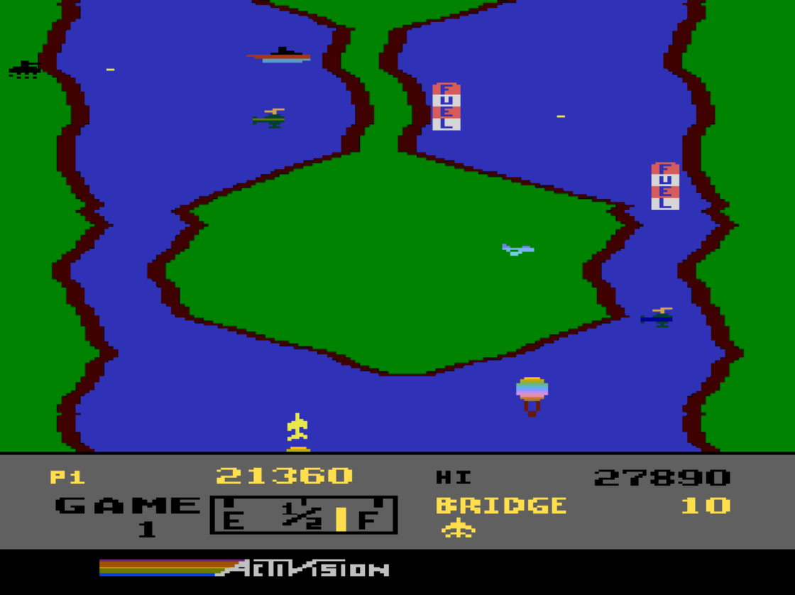

# River Raid

Reproduction of 8-bit Atari game River Raid using TypeScript.<br>
The game is a close copy and it was playtested next to an emulator of the source material. My teacher told me that he feels young again when he started to play :)<br>
<b>Everything</b> is made using pure Typescript and HTML Canvas API.

### You can play the game [here](https://sajecki.ct8.pl/games/river-raid/)



### How to play

Your objective is to kill as many enemies as you can and don't die yourself. Destroy your enemies and their bridges to save your allies! Glory to the victorious!

Controls:
- ANY BUTTON - start the game,
- W - accelerate,
- A - turn left,
- S - slow down,
- D - turn right,
- Space - shoot.

<br>

Rules:
- Use your bullets to destroy enemies. Don't let them fly into you or shoot at you,
- The further you go, the more enemies appear who are more difficult to overcome,
- Fly over a Fuel to refill your tank. You can also destroy it if you want more points,
- Passing a bridge is a checkpoint,
- Every 10.000 points you get an extra life,
- Your highscore is saved in localstorage when you loose the game.

<br>
A page refresh (F5) might be necessary after you had lost the entire game and fancy a new one.

### Usage

To run the code locally, you need to clone this repository, build the project and serve its files. Follow the steps below.<br>

1. Clone the repository
```
git clone git@github.com:Deaponn/riverRaid.git
```
(or)
```
git clone https://github.com/Deaponn/riverRaid.git
```

2. Download dependencies
```
npm i
```

3. Build the project or run it in development state
```
npm run build
```
(or)
```
npm run dev
```

4. Run the project
```
npm run start
```
(not needed when you used `npm run dev` before)

5. Go to `localhost:3000` in your browser and enjoy the game!

### TODO

Things I would like to work on in the near future

- (feature) ~~add additional mapping for arrow keys controls~~
- (feature) ~~add slowing under S key~~
- (feature) add interpolation of player's bullets so they won't miss a target when the framerate is low
- (QoL) ~~make flight sound loop sound nicer~~
- (QoL) ~~remake speed equations so they would be more smooth when stopping braking/accelerating~~
- (bugfix) fix the bug after restarting the whole game after loosing without refreshing the page
- (bugfix) ~~implement bouncing of enemies when they collide with terrain since currently they sometimes get stuck~~
- (bugfix) ~~fix shooting helicopter's bullets collision with the terrain~~